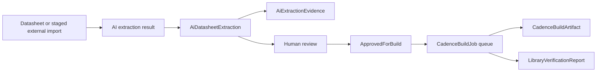

# AI MCP Cadence Pipeline

This document describes the persistence and review model for AI-assisted library creation in `CadenceComponentLibraryAdmin`.

## Scope of Milestone 1

Milestone 1 adds persistence and review structures only.

It does not:

- call OpenAI
- call Cadence Capture
- call Allegro
- generate real `OLB`, `DRA`, `PSM`, or `PAD` files

The goal is to make AI extraction results reviewable and auditable before any Cadence build automation is introduced.

## Pipeline overview



## AI extraction

`AiDatasheetExtraction` stores the top-level normalized result from a datasheet or staged import.

It persists:

- manufacturer
- manufacturer part number
- extraction JSON
- symbol spec JSON
- footprint spec JSON
- confidence
- review status
- optional link to an `OnlineCandidate`
- optional link to an `ExternalComponentImport`

This model is intentionally staging-only and review-oriented.

## Pluggable extraction services

The extraction pipeline is provider-neutral.

Current interfaces:

- `IDatasheetTextExtractor`
- `IAiDatasheetExtractionService`
- `IJsonSchemaValidationService`

Current implementations:

- `LocalPdfTextExtractor`
  - currently a safe placeholder when no approved PDF text extraction library is wired
- `StubAiDatasheetExtractionService`
  - deterministic development and test implementation
  - produces valid `component_extraction`, `symbol_spec`, and `footprint_spec` JSON
- `CodexCliDatasheetExtractionService`
  - optional Docker-hosted CLI provider
  - disabled by default
  - invokes `codex exec` through a controlled Docker bridge adapter
  - validates the final structured output before saving
- `OpenAiCompatibleDatasheetExtractionService`
  - optional
  - disabled by default
  - API key must come from configuration or environment
  - API keys must never be logged

All AI output is validated against repository schemas before save.

### Codex CLI provider

The Codex CLI provider is selected with:

```json
{
  "AiExtraction": {
    "Mode": "CodexCli",
    "CodexCli": {
      "Enabled": true,
      "Transport": "HttpBridge",
      "Command": "codex",
      "Model": "",
      "Profile": "",
      "Sandbox": "read-only",
      "Ephemeral": true,
      "TimeoutSeconds": 180,
      "WorkingDirectory": "",
      "BridgeUrl": "http://codex-cli:4517",
      "BridgeToken": ""
    }
  }
}
```

Runtime behavior:

- the Web application calls `IAiDatasheetExtractionService`
- `CodexCliDatasheetExtractionService` builds a structured extraction prompt
- `CodexCliHttpBridgeRunner` sends the prompt to the Docker `codex-cli` service
- the `codex-cli` service invokes `codex exec` inside its own container
- the CLI final message must contain one JSON object
- the JSON object must include:
  - `componentExtraction`
  - `symbolSpec`
  - `footprintSpec`
  - `confidence`
  - `evidence`
  - `warnings`
- schema validation and critical evidence checks run before the result is saved

The Codex CLI provider does not receive permission to publish library data, run Cadence tools, or execute arbitrary `Tcl` / `SKILL`. It only proposes reviewable JSON that remains in `Draft` or `NeedsReview`.

CI uses fake `ICodexCliRunner` tests and does not require a real Codex CLI login.

### Docker Codex CLI bridge

The supported local Docker path uses a dedicated `codex-cli` service. The Web container does not call a host-installed `codex` executable.

```powershell
docker compose --env-file .env.example -f docker-compose.yml up -d --build codex-cli
```

If the Codex CLI inside the container needs authentication, open the bridge login helper from the host browser:

```text
http://localhost:4517/login
```

The helper starts `codex login --device-auth` inside the `codex-cli` container and opens the authentication URL if the CLI prints one. Device authentication avoids localhost callback failures between the host browser and the Docker container. Credentials remain in the Docker volume `codex-cli-home`.

If the browser helper cannot extract a login URL from the CLI output, run device login in an attached container:

```powershell
docker compose --env-file .env.example -f docker-compose.yml run --rm --entrypoint codex codex-cli login --device-auth
```

Then start Web with Codex CLI extraction enabled:

```powershell
$env:AI_EXTRACTION_MODE="CodexCli"
$env:AI_CODEXCLI_ENABLED="true"
$env:AI_CODEXCLI_TRANSPORT="HttpBridge"
$env:AI_CODEXCLI_BRIDGE_URL="http://codex-cli:4517"
$env:AI_CODEXCLI_PUBLIC_BRIDGE_URL="http://localhost:4517"
docker compose --env-file .env.example -f docker-compose.yml up -d --build web
```

The request path is:

```text
Docker Web -> codex-cli:4517 -> codex exec inside the codex-cli container
```

The `codex-cli` container installs the CLI with `npm install -g @openai/codex` at image build time. Its bridge only exposes:

- `GET /health`
- `GET /login`
- `GET /login/status`
- `POST /login/start`
- `POST /extract`

If `AI_CODEXCLI_BRIDGE_TOKEN` is configured, the Web container sends it as `X-Codex-Bridge-Token` and the bridge validates it.

Use this command to verify the bridge is healthy from the host:

```powershell
curl.exe http://localhost:4517/health
```

## Field-level evidence

`AiExtractionEvidence` stores field-level traceability for extracted values.

Each evidence row can point to:

- a field path
- extracted value text
- optional unit
- source page
- source table
- source figure
- confidence
- reviewer decision and note

This allows a librarian or reviewer to inspect not just the extracted result, but also where it came from.

## Human review

AI extraction is not self-authorizing.

Expected review flow:

1. Extraction enters `Draft` or `NeedsReview`.
2. Evidence rows are reviewed field by field.
3. The extraction is either:
   - kept in review
   - rejected
   - promoted to `ApprovedForBuild`

Approval for build is not the same thing as approval for release.

It only means the extraction is allowed to enter the controlled Cadence build pipeline.

## Capture Tcl job queue

Future Capture automation must use `CadenceBuildJob` records instead of executing raw `Tcl` directly from user input.

Rules:

- no arbitrary raw `Tcl` execution from user input
- only queued jobs may invoke Capture-related actions
- actions must be whitelisted and typed
- inputs must be serialized in `InputJson`
- outputs and machine-readable results must be captured in `OutputJson`

## Allegro SKILL job queue

Future Allegro automation follows the same rule set.

Rules:

- no arbitrary raw `SKILL` execution from user input
- only queued jobs may invoke Allegro-related actions
- only whitelisted actions are allowed
- job inputs and outputs must be persisted for audit and review

## Build jobs and artifacts

`CadenceBuildJob` represents queued or completed work such as:

- `CaptureSymbol`
- `AllegroFootprint`
- `Verification`

`CadenceBuildArtifact` stores outputs linked to a build job, including planned artifact types such as:

- `OLB`
- `DRA`
- `PSM`
- `PAD`
- `STEP`
- `Report`
- `Preview`
- `Json`

Artifacts remain traceable to the job that produced them.

## Verification reports

`LibraryVerificationReport` stores post-build or pre-release verification results.

This can include:

- symbol verification JSON
- footprint verification JSON
- overall pass/warning/fail result

Verification status does not override the librarian approval workflow.

## Approval remains mandatory

Non-negotiable rules:

- AI extraction must be reviewable before Cadence artifact generation
- build jobs must be queued and whitelisted
- generated artifacts remain draft or review data until a librarian approves them
- only approved parts may be published to CIS release views
- this milestone does not alter existing CIS release view behavior
