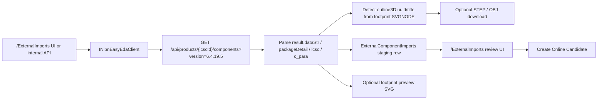

# EasyEDA/LCSC nlbn-style Import

Milestone B4 replaces the EasyEDA Pro SDK extension path with a backend EasyEDA/LCSC client that follows the nlbn-style fetch pattern without vendoring nlbn code.

## Current capability summary

- LCSC ID import
- batch LCSC ID import
- nlbn-style EasyEDA API client
- STEP / OBJ download
- raw symbol / footprint preservation
- footprint preview generation

## Architecture

## nlbn-style EasyEDA API client

- `GET https://easyeda.com/api/products/{lcscId}/components?version=6.4.19.5`
- `GET https://modules.easyeda.com/3dmodel/{uuid}`
- `GET https://modules.easyeda.com/qAxj6KHrDKw4blvCG8QJPs7Y/{uuid}`

The backend preserves the full raw JSON response and extracted subdocuments even when individual normalized fields are missing.

## Field mapping

| Source | Target |
| --- | --- |
| `result.title` | `Name`, MPN candidate fallback |
| `result.description` | `Description` |
| `result.dataStr` | `EasyEdaDataStrRawJson` |
| `result.dataStr.shape` | `SymbolShapeJson` |
| `result.dataStr.head.x/y` | `SymbolBBoxX`, `SymbolBBoxY` |
| `result.dataStr.head.c_para.BOM_Manufacturer` | `Manufacturer` |
| `result.dataStr.head.c_para.package` | `PackageName` and footprint-name candidate |
| `result.dataStr.head.c_para.BOM_JLCPCB Part Class` | `JlcPartClass` |
| `result.packageDetail` | `EasyEdaPackageDetailRawJson` |
| `result.packageDetail.dataStr.shape` | `FootprintShapeJson` |
| `result.packageDetail.dataStr.head.x/y` | `FootprintBBoxX`, `FootprintBBoxY` |
| `result.lcsc` | `EasyEdaLcscRawJson` |
| `result.lcsc.url` | `DatasheetUrl` and manual fallback |
| numeric `result.lcsc.id` without URL | fallback datasheet URL |

## STEP / OBJ download

- The parser scans footprint shapes for lines beginning with `SVGNODE~`.
- If `attrs.c_etype == "outline3D"`, the backend stores:
  - `Model3DUuid`
  - `Model3DName`
- STEP download is optional and saves a staging asset with SHA256.
- OBJ download is optional and saves a staging asset with SHA256.
- Footprint preview generation is best-effort:
  - if richer rendering is not available, the backend creates a placeholder SVG with LCSC ID, title, package name, and a preview-unavailable note.

## LCSC ID import and batch LCSC ID import

- `/ExternalImports` now presents the EasyEDA/LCSC import path as the primary flow.
- Single import supports:
  - LCSC ID
  - Download STEP
  - Download OBJ
  - Generate footprint preview
- Batch import supports:
  - one LCSC ID per line
  - continue on error
  - max parallel imports
  - download STEP
  - generate preview

Imported records remain staging-only until a reviewer explicitly creates an `OnlineCandidate`.

## raw symbol / footprint preservation

- `SymbolShapeJson` stores raw symbol shape data.
- `FootprintShapeJson` stores raw footprint shape data.

## footprint preview generation

- The backend attempts to create a simple SVG preview from staged footprint data.
- If geometric rendering is unavailable, it emits a placeholder SVG instead of failing the import.

## Raw JSON preservation

The backend stores:

- `EasyEdaRawJson`
- `EasyEdaDataStrRawJson`
- `EasyEdaPackageDetailRawJson`
- `EasyEdaLcscRawJson`
- `EasyEdaCParaJson`
- `SymbolShapeJson`
- `FootprintShapeJson`

## Limitations

- this endpoint is not the official `pro-api-sdk`
- EasyEDA fields may change without notice
- not all components include `packageDetail`
- not all footprints include `outline3D`
- not all 3D UUIDs download STEP successfully
- EasyEDA footprints are not converted into Allegro `PSM` / `DRA`
- no imported record becomes an approved Cadence part automatically
