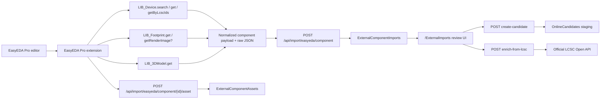

# EasyEDA Pro Import Connector

Milestone B3 introduces a staging-only import connector between EasyEDA Pro and `CadenceComponentLibraryAdmin`.

The connector is intentionally split:

- The EasyEDA Pro extension runs inside the EasyEDA Pro editor and calls the EasyEDA Pro SDK.
- The ASP.NET Core backend receives normalized payloads and assets over authenticated import APIs.
- The backend authorizes ingest with short-lived import tokens tied to authenticated backend users.
- Optional LCSC enrichment runs only through the official LCSC Open API key/secret model.
- Imported data lands only in staging tables:
  - `ExternalImportSources`
  - `ExternalComponentImports`
  - `ExternalComponentAssets`
  - `OnlineCandidates` after explicit candidate creation

No B3 import action creates approved `CompanyParts`, released `FootprintVariants`, or Cadence-ready Allegro assets automatically.

## Architecture



## Authentication model

- EasyEDA Pro SDK calls run only inside an already logged-in EasyEDA Pro editor session.
- The extension must not scrape, extract, store, or forward EasyEDA / LCSC cookies, SSO tokens, passwords, or browser localStorage session values.
- Backend ingest is authorized by `X-Import-Token`.
- Import tokens are created in `/Admin/ExternalImportTokens`, stored only as hashes, scoped by source, revocable, and time-limited.
- `X-Import-Api-Key` is now only a deprecated Development fallback when enabled intentionally.
- Optional LCSC enrichment uses official LCSC Open API credentials (`ApiKey` + `ApiSecret`) only on the backend.

## Confirmed SDK APIs

The following APIs are documented in the EasyEDA Pro SDK documentation and are used or referenced by the connector:

| API / type | Status | Purpose in B3 | Notes |
| --- | --- | --- | --- |
| `LIB_Device.search(key, libraryUuid?, classification?, symbolType?, itemsOfPage?, page?)` | Confirmed | keyword search for candidate devices | Documented as BETA. |
| `LIB_Device.get(deviceUuid, libraryUuid?)` | Confirmed | retrieve full device details | Documented as BETA. |
| `LIB_Device.getByLcscIds(...)` | Confirmed | direct LCSC C-number lookup | Documented as BETA; private deployments may not support it. |
| `LIB_3DModel.get(modelUuid, libraryUuid?)` | Confirmed | retrieve 3D model metadata when association exists | Documented as BETA. |
| `ILIB_DeviceSearchItem` | Confirmed | normalized search result metadata | Includes `uuid`, `libraryUuid`, `manufacturer`, `supplier`, prices, inventory, symbol / footprint / 3D associations. |
| `ILIB_DeviceItem` | Confirmed | full device payload | Used for raw preservation and best-effort normalization. |
| `ILIB_DeviceAssociationItem` | Confirmed | symbol / footprint / 3D associations | Used to preserve device association snapshots. |
| `ILIB_DeviceExtendPropertyItem` | Confirmed | extended device property bag | Used for supplier / manufacturer and other properties. |
| `ILIB_3DModelItem` | Confirmed | 3D model metadata | Preserved in raw JSON and normalized 3D fields. |
| `LIB_Footprint.getRenderImage` | Best-effort | obtain footprint render image / thumbnail | Required by the milestone, but this method was not discoverable in the public reference index during implementation review. The extension calls it only when the runtime exposes it. |

Primary references used during implementation:

- [LIB_Device.search()](https://prodocs.easyeda.com/en/api/reference/pro-api.lib_device.search.html)
- [LIB_Device.get()](https://prodocs.easyeda.com/en/api/reference/pro-api.lib_device.get.html)
- [LIB_Device.getByLcscIds()](https://prodocs.easyeda.com/en/api/reference/pro-api.lib_device.getbylcscids.html)
- [LIB_Device class](https://prodocs.easyeda.com/en/api/reference/pro-api.lib_device.html)
- [ILIB_DeviceSearchItem](https://prodocs.easyeda.com/en/api/reference/pro-api.ilib_devicesearchitem.html)
- [ILIB_DeviceItem](https://prodocs.easyeda.com/en/api/reference/pro-api.ilib_deviceitem.html)
- [ILIB_DeviceExtendPropertyItem](https://prodocs.easyeda.com/en/api/reference/pro-api.ilib_devicepropertyitem.html)
- [LIB_3DModel.get()](https://prodocs.easyeda.com/en/api/reference/pro-api.lib_3dmodel.get.html)
- [Extension API guide](https://prodocs.easyeda.com/en/api/guide/)
- [easyeda/pro-api-sdk](https://github.com/easyeda/pro-api-sdk)

## Field mapping

| Backend field | Mapping strategy | Confidence |
| --- | --- | --- |
| `SourceName` | fixed to `EasyEDA Pro` by default | High |
| `ExternalDeviceUuid` | `searchItem.uuid` / selected device UUID | High |
| `ExternalLibraryUuid` | `searchItem.libraryUuid` or selected library UUID | High |
| `LcscId` | best-effort from direct API field or otherProperty scan | Medium |
| `Name` | `searchItem.name` or `deviceItem.name` | High |
| `Description` | `searchItem.description` or device description | High |
| `ClassificationJson` | full classification object serialized as JSON | High |
| `Manufacturer` | search item first, then device property | High |
| `ManufacturerPN` | best-effort from device property / raw property scan | Medium |
| `Supplier` / `SupplierId` | search item first, then device property | High |
| `Symbol*` | device association or search-item symbol reference | High |
| `Footprint*` | device association or search-item footprint reference | High |
| `Model3D*` | device association plus `LIB_3DModel.get` when UUID exists | Medium |
| `DatasheetUrl` / `ManualUrl` / `StepUrl` | extracted by heuristics from nested property bags and association payloads | Medium |
| `JlcInventory` / `JlcPrice` | `ILIB_DeviceSearchItem` values when returned | High |
| `LcscInventory` / `LcscPrice` | `ILIB_DeviceSearchItem` values when returned | High |
| `ImageUuidsJson` | collected from search item or nested raw objects | Medium |
| `FullRawJson` and other raw snapshots | serialized raw SDK payloads | High |

## Raw JSON strategy

The connector preserves raw data aggressively:

- `SearchItemRawJson`
- `DeviceItemRawJson`
- `DeviceAssociationRawJson`
- `DevicePropertyRawJson`
- `OtherPropertyRawJson`
- `FullRawJson`
- `SymbolRawJson`
- `FootprintRawJson`
- `Model3DRawJson`

Rules:

- If a field is uncertain, leave the normalized field empty.
- Preserve the original payload fragment instead of guessing.
- Store nested / extra properties in raw JSON even when a normalized field is also populated.

Sample payloads live under:

- `docs/samples/easyeda/component-basic.json`
- `docs/samples/easyeda/component-with-symbol-footprint-3d.json`
- `docs/samples/easyeda/component-with-datasheet-manual-step.json`
- `docs/samples/easyeda/component-minimal-missing-fields.json`

## Asset handling

Asset storage is file-based in B3.

- Backend config:
  - `ExternalImports:StorageRoot`
- Default local value:
  - `App_Data/ExternalImports`
- Docker override:
  - `/app-data/ExternalImports`

Supported asset types:

- `Thumbnail`
- `FootprintRenderImage`
- `Datasheet`
- `Manual`
- `Step`
- `Model3D`
- `SymbolRaw`
- `FootprintRaw`
- `DeviceRaw`
- `SearchRaw`
- `Other`

The backend stores:

- file metadata
- `SHA256`
- optional original URL
- optional raw metadata JSON

Large binary payloads are not stored in SQL Server.

## Security notes

- Import ingest endpoints require `X-Import-Token`.
- The token is created in `/Admin/ExternalImportTokens` and the raw value is shown only once.
- `X-Import-Api-Key` may remain enabled only as a Development fallback for local transition scenarios.
- `create-candidate` requires an authenticated application user with `Admin`, `Librarian`, or `EEReviewer`.
- LCSC `ApiSecret` must come from environment variables or user secrets and must never be stored in the database.
- No public unauthenticated page can create approved library records.
- No EasyEDA / LCSC cookies, passwords, SSO tokens, or session values are extracted or stored.

## API smoke examples

Import a component payload:

```bash
curl -X POST "http://localhost:8080/api/import/easyeda/component" \
  -H "Content-Type: application/json" \
  -H "X-Import-Token: <your-token>" \
  --data @docs/samples/easyeda/component-with-symbol-footprint-3d.json
```

Upload a thumbnail or footprint render image:

```bash
curl -X POST "http://localhost:8080/api/import/easyeda/component/123/asset" \
  -H "X-Import-Token: <your-token>" \
  -F "assetType=FootprintRenderImage" \
  -F "file=@./preview.png" \
  -F "externalUuid=img-preview-001" \
  -F "rawMetadataJson={\"source\":\"EasyEDA render\"}"
```

Upload a STEP asset:

```bash
curl -X POST "http://localhost:8080/api/import/easyeda/component/123/asset" \
  -H "X-Import-Token: <your-token>" \
  -F "assetType=Step" \
  -F "file=@./part.step" \
  -F "rawMetadataJson={\"source\":\"manual-export\"}"
```

Create an `OnlineCandidate` from a staged import:

```bash
curl -X POST "http://localhost:8080/api/import/easyeda/component/123/create-candidate" \
  -b "<authenticated-app-cookie>" \
  -H "RequestVerificationToken: <if-your-client-sends-one>"
```

The `create-candidate` endpoint is intentionally separate from the import ingest flow:

- import APIs are import-token protected
- candidate creation requires an authenticated app user
- neither flow creates an approved `CompanyPart`

## LCSC Open API enrichment

- Required setup:
  - apply for official LCSC Open API access
  - configure `LcscOpenApi:Enabled`, `BaseUrl`, `ApiKey`, `ApiSecret`, and `Currency`
- Signature model:
  - `nonce` = 16-character random string
  - `timestamp` = current Unix timestamp
  - `signature = sha1("key={key}&nonce={nonce}&secret={secret}&timestamp={timestamp}")`
- Current workflow:
  - enrichment is explicit from the `External Import Details` page
  - if `LcscId` exists, the backend calls item details directly
  - otherwise the backend searches by `ManufacturerPN`, then follows up with item details
  - results only update staging fields and raw JSON on `ExternalComponentImport`
- Compliance notes:
  - respect LCSC timestamp validation and rate limits
  - do not bulk scrape or reverse-engineer endpoints
  - do not automatically download datasheets/images unless configuration and API terms allow it
  - enrichment never creates approved `CompanyParts`

## Known limitations

- EasyEDA library APIs used here are documented as BETA and may change.
- `LIB_Device.getByLcscIds` is documented as unavailable in private deployments.
- `LIB_Footprint.getRenderImage` could not be confirmed through the public reference index during implementation; the extension only uses it when the runtime exposes it.
- The extension build is CI-safe because type-checking and sanity checks only execute pure helper logic; any direct EasyEDA editor APIs remain runtime-only inside EasyEDA Pro.
- STEP download URLs or binary STEP files are not guaranteed by the SDK; B3 stores URLs, metadata, or uploaded files only when they are actually obtainable.
- Imported footprints are not converted into Allegro `PSM` / `DRA`.
- Imported components never become approved Cadence parts automatically.
